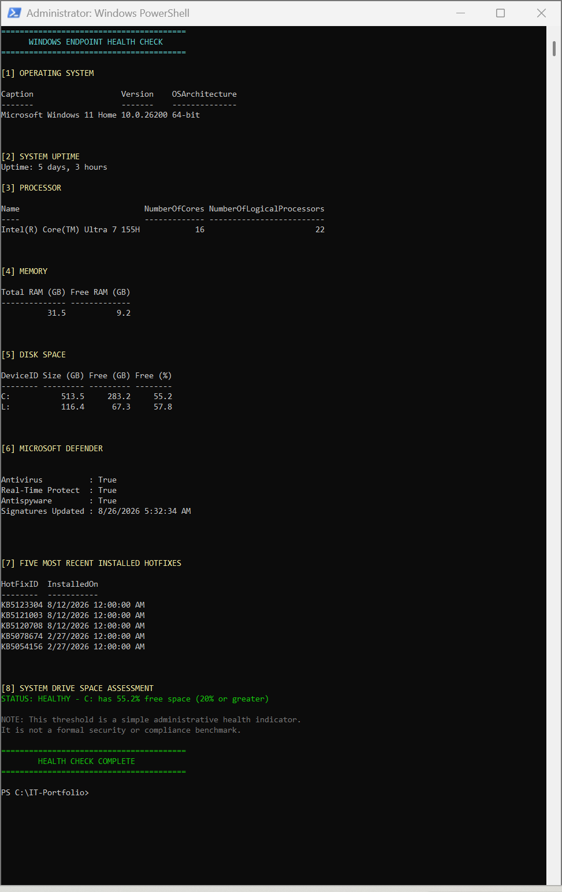

# Windows Endpoint Health Check

A lightweight PowerShell utility for collecting common Windows endpoint health information and performing a basic automated disk-space assessment.

## Overview

This project demonstrates the use of PowerShell for Windows endpoint administration, system-information collection, and basic automated health assessment.

The script collects several common endpoint-health indicators from a local Windows system and presents them in a single readable console report.

The script is read-only and does not modify Windows configuration.

## Checks

The script reports:

- Windows operating system, version, and architecture
- System uptime
- Processor model, physical cores, and logical processors
- Total and available physical memory
- Fixed-disk capacity and available disk space
- Microsoft Defender antivirus status
- Microsoft Defender real-time protection status
- Microsoft Defender antispyware status
- Microsoft Defender signature update timestamp
- Five most recently installed Windows hotfixes
- Automated system-drive free-space assessment

## Automated Assessment

The final section evaluates available space on the Windows system drive using a simple administrative threshold:

- **HEALTHY:** 20% or more free space
- **WARNING:** Less than 20% free space
- **UNKNOWN:** System-drive information could not be reliably retrieved

This threshold is intended as a basic endpoint-health indicator. It is not a formal security, compliance, or vendor benchmark.

## Requirements

- Windows 10 or Windows 11
- Windows PowerShell 5.1 or a compatible Windows PowerShell environment
- Windows CIM/WMI functionality
- Microsoft Defender cmdlets for Defender reporting

Running PowerShell as Administrator is recommended for consistent access to system information.

## Usage

Open PowerShell, navigate to the directory containing the script, and run:

```powershell
.\EndpointHealthCheck.ps1
```

The script performs read-only queries and does not require configuration changes to perform its normal checks.

## Example Output

The console output is organized into numbered sections and uses color-coded status messages to make the results easier to review.



Example output from the initial local test run. The current revision uses more precise terminology for disk space and installed hotfixes.

## PowerShell Concepts Demonstrated

This project uses several common PowerShell and Windows-administration concepts, including:

- `Get-CimInstance`
- Windows CIM classes
- PowerShell pipelines
- `Select-Object`
- Calculated properties
- `PSCustomObject`
- Date/time arithmetic
- Sorting and filtering
- Microsoft Defender cmdlets
- Windows hotfix enumeration
- Conditional logic
- Basic error handling
- Formatted console output

## Purpose

I created this project as a practical exercise in PowerShell-based Windows endpoint administration.

The goal was to consolidate several common system-health checks into a repeatable script and then add a simple automated assessment rather than relying entirely on manual review.

The project reinforces a basic administrative principle:

> If a diagnostic process is repeatable, it is a candidate for automation.

## Scope and Limitations

This is a lightweight local endpoint-health utility.

It is not:

- A vulnerability scanner
- An endpoint detection and response platform
- A full monitoring platform
- A patch-compliance assessment
- A hardware diagnostic utility
- A comprehensive endpoint-security assessment

The disk section reports capacity and free space; it does not evaluate physical disk or SMART health.

The hotfix section displays recently installed hotfix information; it does not prove that every applicable Windows update has been installed.

Microsoft Defender information reflects the state reported by the local Defender cmdlets when the script executes.

The script currently evaluates a single local Windows endpoint.

## Safety

The script performs read-only queries.

It does not:

- Modify Windows configuration
- Change Microsoft Defender settings
- Install or remove updates
- Modify disks or filesystems
- Change user accounts
- Modify registry settings
- Change services
- Alter PowerShell execution policy

## Future Improvements

Potential future development includes:

- Export to CSV or JSON
- Configurable disk-space thresholds
- Additional system-health checks
- Event-log health information
- Optional service-status reporting
- Remote endpoint support
- Structured reporting for repeated administrative checks

These are future possibilities and are intentionally not implemented in the current version.

## License

This project is licensed under the MIT License. See `LICENSE` for details.
